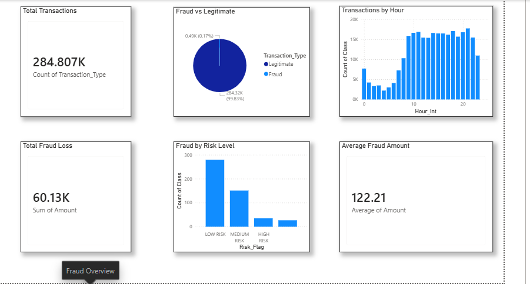
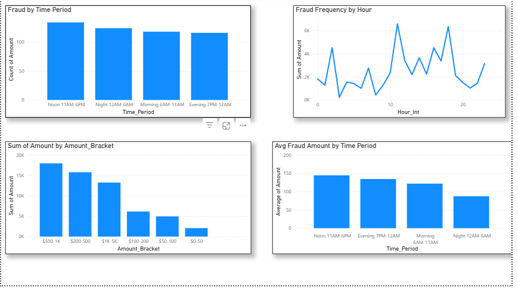
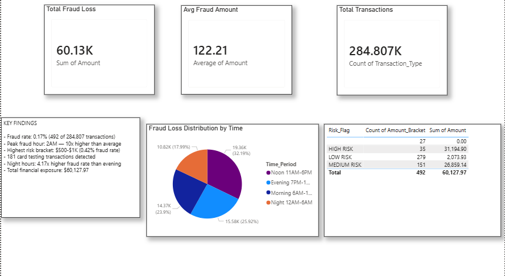

# Credit Card Fraud Detection & Spending Analysis

## Project Overview
End-to-end data analysis of 284,807 real credit card transactions to identify fraud patterns, quantify financial exposure, and provide actionable recommendations for a European bank's risk management team.

## Key Findings
- **Fraud rate:** 0.17% (492 fraud cases out of 284,807 transactions)
- **Total fraud exposure:** $60,127.97
- **Peak fraud hour:** 2AM — fraud rate 10x higher than daily average
- **Highest risk bracket:** $500-$1K with 0.42% fraud rate
- **181 card testing transactions** detected — fraudsters verifying stolen cards with sub-$1 purchases
- **Night hours (12AM-6AM):** 4.17x higher fraud rate despite lowest transaction volume

## Dashboard Preview

## Tools & Technologies
| Tool | Purpose |
|------|---------|
| Python (pandas, numpy) | Data loading, cleaning, feature engineering |
| Matplotlib & Seaborn | Exploratory data analysis — 10 charts |
| SQLite + SQL | 10 business KPI queries |
| Power BI | 3-page interactive dashboard |
| GitHub | Version control & portfolio hosting |

## Project Structure
- 01_data_loading.ipynb — Data ingestion and initial exploration
- 02_eda_cleaning.ipynb — EDA with 10 visualizations
- 03_sql_analysis.ipynb — 10 SQL business KPI queries
- dashboard_page1.png — Power BI Fraud Overview
- dashboard_page2.png — Power BI Time and Amount Analysis
- dashboard_page3.png — Power BI Executive Summary

## Dataset
- Source: Kaggle — ULB Machine Learning Group
- Link: https://www.kaggle.com/datasets/mlg-ulb/creditcardfraud
- Size: 284,807 transactions over 2 days (September 2013)
- Features: 31 columns — Time, V1-V28 (PCA anonymized), Amount, Class

## Business Recommendations
1. Implement SMS/OTP verification for transactions above $100 between 12AM-6AM
2. Flag cards making 3+ transactions under $2 within 10 minutes (card testing detection)
3. Increase monitoring for $500-$1K bracket during noon hours
4. Deploy real-time alerts for cumulative fraud exposure tracking

## Author
Joby Joshy — Aspiring Data Analyst | Finance and Banking Domain
GitHub: https://github.com/jobyjoshy7910-arch
